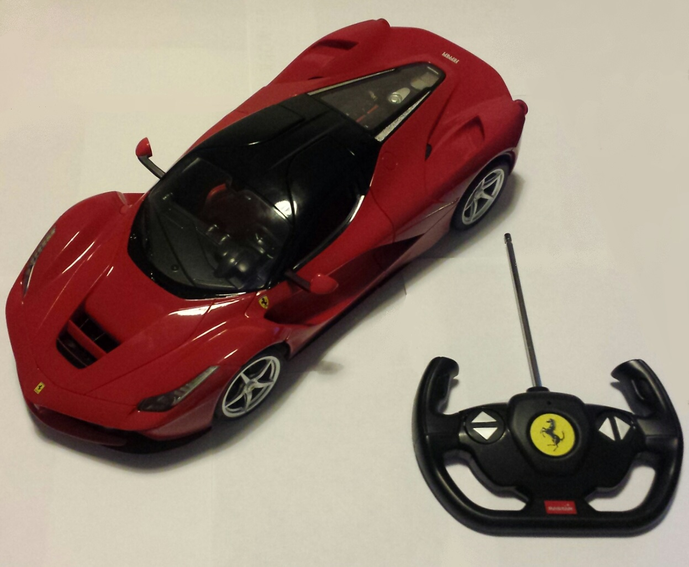
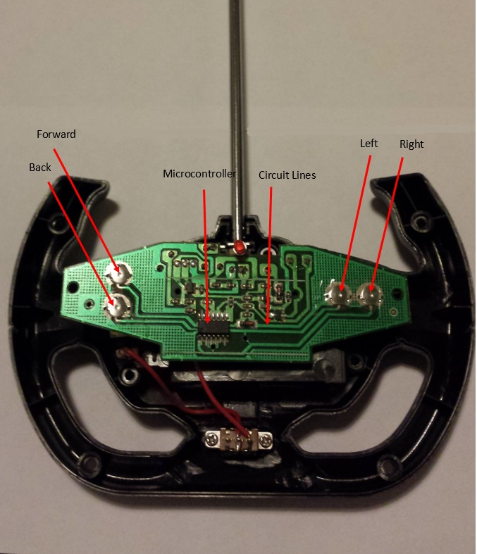
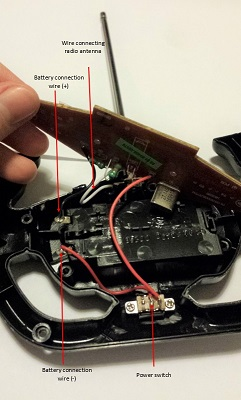
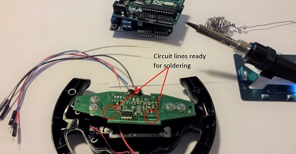
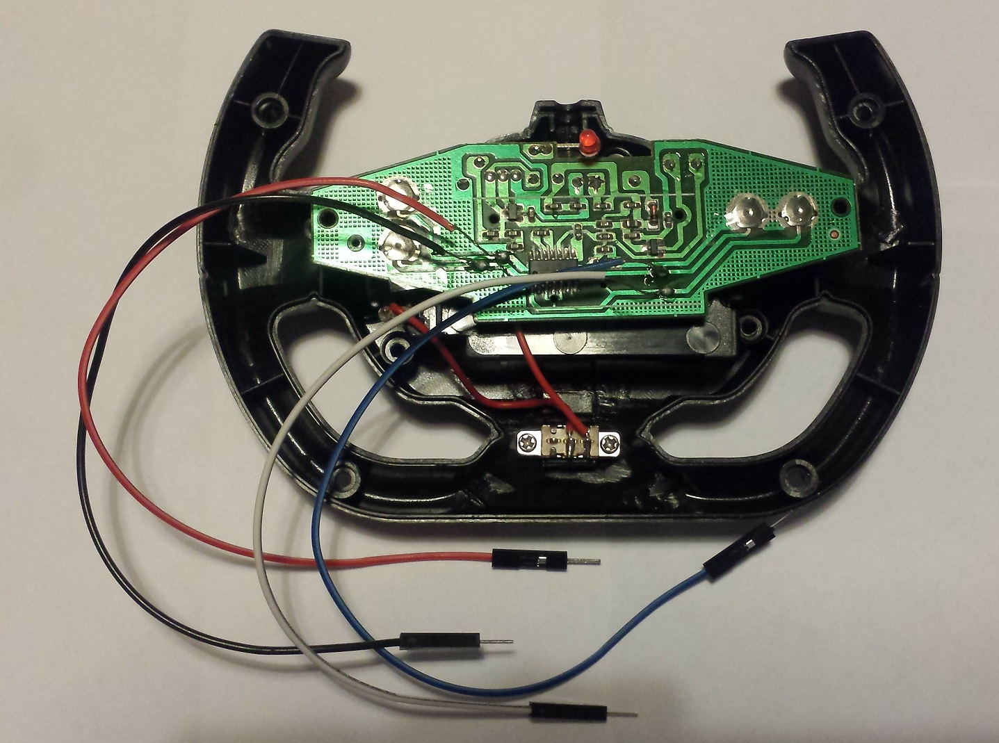
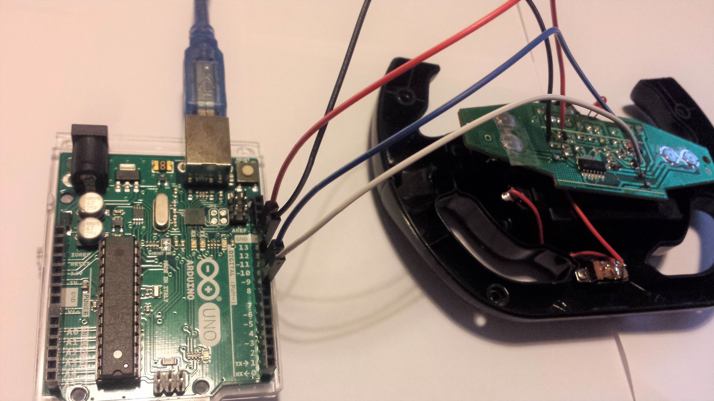

[//]: # (Image References)

[image1]: ./images/img1.jpg "img1"
[image2]: ./images/img2.jpg "img2"
[image3]: ./images/img3.jpg "img3"
[image4]: ./images/img4.jpg "img4"
[image5]: ./images/img5.jpg "img5"
[image6]: ./images/img6.jpg "img6"
[image7]: ./images/car_works.gif "car_works"

# STAGE ONE: Hacking RC car with Arduino
This part is going to cover how to set up the hardware and hack the RC car so it would be controlled by code rather than physical input. Here are the tools which I needed to kick things off:

__-__ An RC car. Any type of RC car should do the job, but it’s probably not worth getting an expensive one, because it will have to be deconstructed anyway. I let my inner geek out and chose a shiny red Ferrari. 😊  

__-__ Arduino Uno and a connection cable. Arduino is a microcontroller which is going to be used to programmatically control the car. 

__-__ Multimeter. Multimeter is an electronic measuring instrument which is going to be used to check polarity of pins on the circuit board as well as to check if created connections are working.

__-__ Soldering iron and solder wire. They will be needed to attach necessary wires to the circuit board.

__-__ Wires. Male-to-female or male-to-male wires would be best.

__-__ A wire cutter.

__-__ Screwdrivers.

## Step One: Investigation

Once I got all the tools, I checked if my car actually works as it should. I plugged in the batteries (my car needed five 1.5V AA batteries and one 9V battery for a controller) and tested it out.

  

Once I was sure that everything works as it should I was ready to start hacking. My goal was change how the car is controlled – instead of me pushing the forward, back, left and right buttons on the controller I wanted to execute these commands programmatically. The easiest way to achieve this is to hack the controller and simulate button presses with Arduino. The first step to achieve this was to investigate how the controller is set up from the inside. After I unscrewed the plastic cover this is how the controlled looked like from the inside:

  

  

There are four pins which get activated once I press the buttons on the controller (forward, back, left or right). Once any of these buttons are pressed a signal is being sent to a microcontroller through circuit lines. It is also a good idea to unscrew the screws which are holding the board attached to the case and look at wire connections. There two main connections – the battery and radio antenna. If preferred, the power supply can be changed by reattaching positive and negative wires to a different battery or power supply (for now I chose to keep it as it is). At this stage it’s also a good idea to use a multimeter and check the voltage of the pins on the board (especially if you would like to make changes in how the power is supplied).

## Step 2: The fun begins – let’s do some soldering!

In order to connect circuit board and Arduino I needed to solder four wires onto the circuit board (for each of the buttons). Unfortunately, my circuit board didn’t have free solder pins for this so I decided to solder the wires directly onto the circuit lines (it’s a bit less elegant way of doing that, but works as intended). To do that I scraped (very carefully!!!) the thin layer of plastic on each of the circuit lines connecting the buttons and microcontroller. 

  

Once the surfaces were ready I soldered four wires directly onto the scraped areas (it’s quite a neat thing to do, because the circuit lines are thin so it’s best not to rush). I used the wires which had a male connection on one end to make it easy to connect them to Arduino. Once soldered, I used a multimeter to check if all wires were soldered successfully. This is how the result of soldering looked like:

  

If you have never done soldering before I would encourage you to look up some tutorials on how to do it on Youtube or the web. In fact, it’s not that complicated as it looks like, just be careful and don’t burn your fingers! This project was my first attempt to solder things as well and I still remember that proud moment when I pulled it off 😊 

## Step 3: Coding the Arduino

Time to code! The easiest way to code the Arduino is to use and IDE which can be downloaded from Arduino official website https://www.arduino.cc/en/Main/Software. Once installed plug the Arduino to your computer and open the IDE. Place a zip code of DigitalPin library in Arduino/libraries folder on you machine load it by navigating to Sketch -> Include Library -> Add .ZIP Library.. on Arduino IDE. Once it’s done paste the sample code provided in car_motion.in file. The code itself is very simple. First I initialised four DigitalPins (for going forward, backward, left and right) and assigned each of them the number of which Arduino pin it’s going to correspond to. Second part of the code is a very simple loop which makes the car move forward, stop for a second, go backward-right and stop for a second again. It’s going to be enough for testing and I also have to get more comfortable with using C++ to write more complicated code. Once the code is written all is left to do is to verify that the code executes without any errors and to upload it on Arduino.

## Step 4: Connecting it all together: a Robo-Ferrari comes to life!

It’s time to connect all things together! The key is to plug the wires, which were soldered to forward, back, left and right circuit lines, to corresponding pins of Arduino. In my code I initialised digital pins as follows: forward(13), backward(12), left(9) and right (8). This suggest that I should connect the wire which was connected to forward circuit line to the Arduino pin number 1, backward wire to the pin number 12 and so on.

  

Once it’s done all is left to do is to power the Arduino (for now I chose to power it with my computer so I plugged it back to my PC), turn the power on for a controller and see the car coming to life! And here it is – an RC car which behaviour can be controlled with code!😊

  

